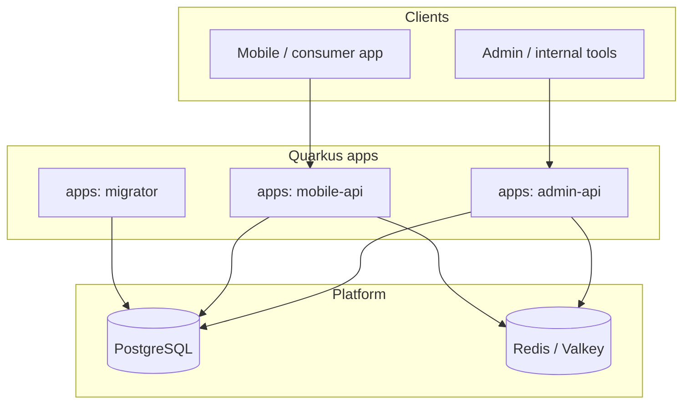
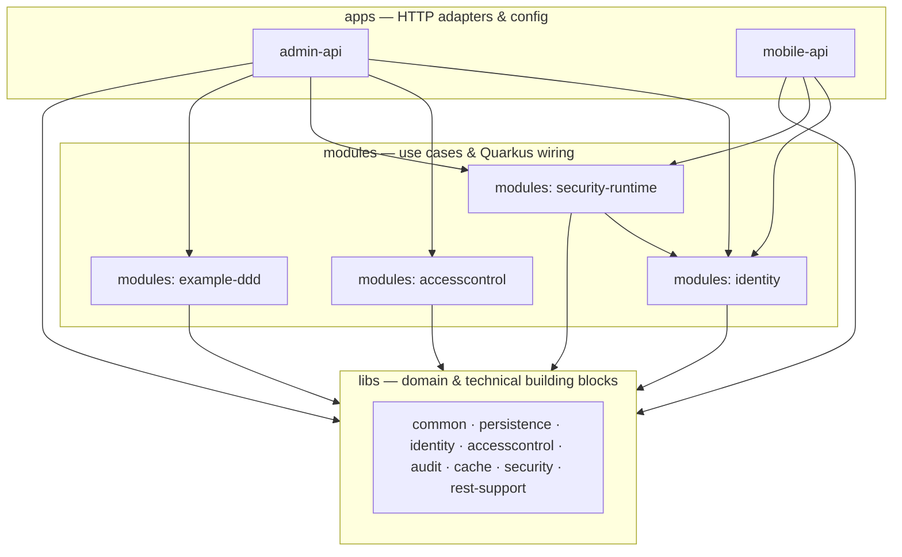
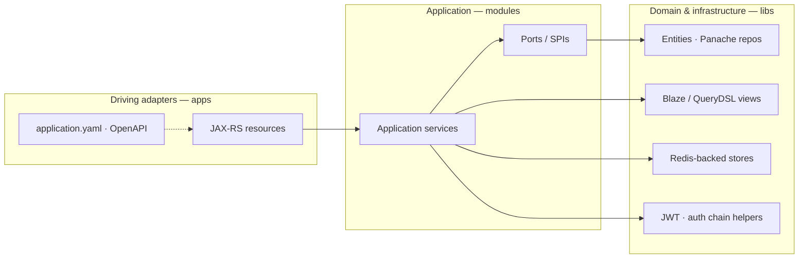
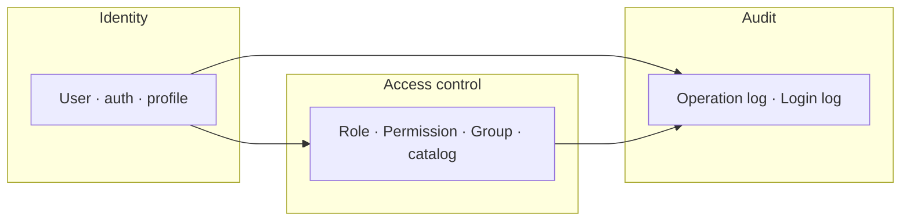
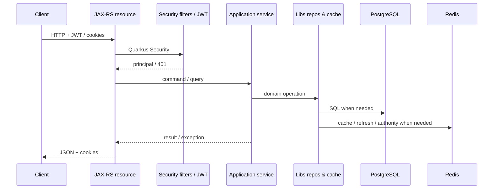

# Project Design & Technology Choices

[中文](PROJECT_DESIGN.zh-CN.md)

This document explains **why** the repository is structured the way it is, how it maps to a **production-oriented modular monolith**, what you gain from it, how it supports a **CQRS-lite** read/write split, and the **concrete technology stack** (with versions aligned to `gradle/libs.versions.toml`).

For package trees and Gradle project names, see also [ARCHITECTURE_DDD.md](ARCHITECTURE_DDD.md).

This repository is optimized for **production delivery first**: pragmatic layering, strong security defaults, and room to evolve the read side independently of the write side. It should not be read as a textbook-pure DDD sample.

---

## 1. Design goals

The template aims to be a **production-oriented foundation** for JVM backends that need:

- **RBAC** with cache-friendly permission snapshots
- **JWT** access tokens and **refresh** flows
- **Multiple deployable processes** sharing the same domain (e.g. admin vs mobile) without duplicating core logic
- **Clear boundaries** so new features do not collapse into a single “god” application package
- **Tooling**: formatting, static analysis, coverage, dependency vulnerability checks

The layout is **not** a formal textbook hexagon for every class; it is a **pragmatic DDD split**: shared model and infrastructure building blocks in **`libs`**, use cases and orchestration in **`modules`**, HTTP and process config in **`apps`**.

---

## 2. Overall structure (three Gradle layers)

| Layer | Gradle projects | Role |
|-------|-----------------|------|
| **Shared kernel & technical blocks** | `libs:*` | Entities, Panache repositories, Redis-backed stores, security primitives, shared JAX-RS helpers. Reusable across modules and apps. |
| **Application / bounded context** | `modules:*` | Application services, ports (interfaces), CDI-friendly adapters that tie domain operations to Quarkus features where needed. One folder per major context (`identity`, `accesscontrol`, `security-runtime`, `example-ddd`). |
| **Driving adapters & deployment** | `apps:*` | JAX-RS resources, OpenAPI exposure, `application.yaml`, and **which** modules are on the classpath. Same domain, different **deployment unit** and **API surface** (`admin-api` vs `mobile-api`). |

**Dependency rule (intended):** `apps` → `modules` → `libs`. `modules` should not depend on each other in a deep graph except where explicitly needed (e.g. `security-runtime` builds on `modules:identity`). This keeps compile-time boundaries visible in Gradle.

Current guardrails are intentionally stricter than the original sketch:

- `apps` depend on `modules`, with only a small allowlist of direct app-to-lib dependencies.
- `modules` depend on `libs`, with an explicit allowlist for the current `security-runtime -> identity` dependency.
- Shared read-model libraries are kept free of `@QueryParam`, so HTTP binding stays in adapters.

This is the repository's baseline for a **CQRS-lite** evolution path: write-side services keep command/domain concepts, while the read side can change implementation without changing REST contracts.

### 2.1 Architecture diagrams (Mermaid)

#### System context: deployable processes and platform

Clients talk to **admin-api** or **mobile-api**; **migrator** applies Flyway to PostgreSQL. Both APIs use PostgreSQL and Redis/Valkey for persistence, tokens, permission snapshots, and optional replay nonces.

#### Compile-time layering: `apps` → `modules` → `libs`

Gradle enforces which code is visible to which deployable unit. **mobile-api** intentionally omits **accesscontrol** and **example-ddd** so consumer APIs cannot depend on admin CRUD or sample domain code.

*(**apps:migrator** is a separate Flyway/JDBC process; see the system-context diagram above.)*

#### DDD mapping inside a single API process

HTTP stays in **apps**; orchestration in **modules**; entities, repositories, Redis helpers, and security primitives primarily in **libs**. **rest-support** supplies shared JAX-RS cross-cutting behavior to every app that declares the dependency.

#### Bounded contexts (RBAC core)

Identity (users, login, profile) collaborates with access control (roles, permissions, groups). Audit records operational and login events from those flows.

In practice, `identity` and `accesscontrol` are currently two **RBAC core slices**, not two fully independent bounded contexts. They are packaged separately for ownership and app composition, but still share a direct relational model.

#### Conceptual request flow (authenticated call)

---

## 3. DDD-style layering (how it maps)

Classic DDD speaks of **domain**, **application**, **infrastructure**, and **interfaces**. This repo maps them as follows:

- **Domain model (entities, value objects, invariants)**  
  Primarily in **`libs`** under context-specific libraries (`libs:identity`, `libs:accesscontrol`, `libs:audit`, …). Persistence annotations and Panache bases live close to the model for pragmatism (anemic vs rich domain is up to you; the split still isolates **business vocabulary** from HTTP).

- **Application layer (use cases, orchestration, ports)**  
  In **`modules:*`** (e.g. `modules:identity` for login/profile flows, `modules:accesscontrol` for user/role/permission operations). These coordinate entities, repositories, cache, and security without knowing HTTP path strings.

- **Infrastructure (DB, Redis, JWT, filters)**  
  Split between **`libs`** (generic technical implementations: cache stores, Blaze/QueryDSL query helpers) and **`modules:security-runtime`** (Quarkus-specific wiring: authentication pipeline, JWT issue, permission augmentor, replay filter).

- **Driving adapters (REST)**  
  In **`apps/*`** as thin resources that translate HTTP ↔ application services/DTOs. Shared exception mapping and cookie helpers live in **`libs:rest-support`** so every process behaves consistently.

### 3.1 CQRS-lite read side

- `apps:*` own `@BeanParam` / `@QueryParam` binding and map those inputs into pure read-query models.
- `libs:identity:query` and `libs:accesscontrol:query` expose HTTP-free read-query objects.
- Blaze-Persistence and QueryDSL are the current read-side implementations.
- Doma can be introduced later on the read side without changing resource signatures or application-service query contracts.

**Bounded contexts** in the RBAC template:

| Context | Libraries | Module |
|---------|-----------|--------|
| Identity & auth orchestration | `libs:identity`, `libs:security`, `libs:cache`, … | `modules:identity` |
| RBAC administration | `libs:accesscontrol`, `libs:identity`, … | `modules:accesscontrol` |
| Cross-cutting security runtime | (pulls from libs) | `modules:security-runtime` |
| Audit | `libs:audit` | Used from identity/accesscontrol flows |
| Example business slice | `libs:persistence`-style entities in module | `modules:example-ddd` |

`modules:example-ddd` is a **packaging reference** for adding a new context: ports in the module, Panache (or other) adapters alongside, REST only in an app that chooses to depend on it. It demonstrates module structure and read/write separation, not a claim that every class is already a rich-domain exemplar.

---

## 4. Benefits

1. **Clear ownership**  
   RBAC vs identity vs “sample commerce” live in different Gradle projects. Code review and onboarding can refer to **context names** instead of scanning one giant package.

2. **Controlled dependencies**  
   Gradle enforces **what may call what**. For example, `mobile-api` does not pull in `modules:accesscontrol`, so C-side endpoints cannot accidentally depend on admin CRUD services.

3. **Testability**  
   Application services in `modules` can be tested with mocks/fakes of ports without starting HTTP. Integration tests stay at app or module boundaries as you prefer.

4. **Operational flexibility**  
   Admin and mobile can **scale, configure, and release** independently while sharing JWT, Redis, and DB conventions. Shared behavior (exceptions, refresh cookies) is centralized in **`libs:rest-support`**.

5. **Reduced duplication**  
   One implementation of permission catalog caching, token storage, and exception mapping; multiple apps **compose** it.

---

## 5. Evolution path (what becomes easy later)

Because adapter-side query params now map into pure read-query models, the repository is positioned for a **CQRS-lite** read stack where Hibernate keeps normal write flows and Blaze/QueryDSL/Doma can evolve independently on the read side.

| Direction | How the structure helps |
|-----------|-------------------------|
| **New bounded context** | Add `libs:your-context` (model + persistence) and `modules:your-context` (use cases + adapters). Optionally depend from `admin-api` only. |
| **New API process** | New `apps:your-api` with its own `application.yaml`, `app.identity.*`, and a minimal set of `modules`/`libs` dependencies. |
| **Replace or split read infrastructure** | Adapter-side query params map into pure read-query models, so Blaze/QueryDSL repositories can later be replaced or complemented by Doma without rewriting REST classes first. |
| **Stricter hexagon** | Move Panache entities to “infrastructure” packages inside a module while keeping interfaces in `domain`/`application` packages—the Gradle split already gives you a place to do that incrementally. |
| **Shared contracts** | OpenAPI per app; internal DTOs stay next to resources; cross-app contracts can later move to a small `libs:api-contract` if needed. |

---

## 6. Technology stack (details)

Versions below are taken from the version catalog; bump them in **`gradle/libs.versions.toml`** when upgrading.

### 6.1 Platform & language

| Choice | Version / note |
|--------|----------------|
| **JDK** | **25** (Gradle toolchain; language features such as flexible constructor bodies are used in places) |
| **Quarkus** | **3.32.4** (BOM) |
| **Build** | Gradle with **typesafe project accessors** (`projects.libs.*`, `projects.modules.*`) |

### 6.2 HTTP & API

| Choice | Note |
|--------|------|
| **Jakarta REST** (`quarkus-rest`, `quarkus-rest-jackson`) | Server-side REST, JSON via Jackson |
| **SmallRye OpenAPI** | `/q/openapi`, Swagger UI in dev |
| **Hibernate Validator** | Bean Validation on resources and services |

### 6.3 Data access & schema

| Choice | Version / note |
|--------|----------------|
| **PostgreSQL** | `quarkus-jdbc-postgresql`, Agroal pool |
| **Hibernate ORM + Panache** | Active Record / repository style in `libs` |
| **Schema management** | Often **`validate`** in apps; **Flyway** in `apps:migrator` |
| **Blaze-Persistence** | **1.6.18** + Quarkus integration; Entity Views for query/projection scenarios |
| **QueryDSL** | **7.1** (Jakarta classifier via APT); integrated with Blaze where configured |
| **Snowflake IDs** | `io.github.daiyuang:hibernate-snowflake-id:0.0.1` (where used) |
| **Naming** | e.g. `CamelCaseToUnderscoresNamingStrategy` for physical column names |

### 6.4 Security & identity

| Choice | Note |
|--------|------|
| **Quarkus Security** | Integration with HTTP permissions |
| **SmallRye JWT** | Verify/sign; RSA keys via project task `generateRsaKeys` |
| **Elytron common** | Shared security utilities |
| **Custom provider chain** | Config + DB login orchestration in `libs:security` / `modules:security-runtime` |
| **Password hashing** | BCrypt (see config users in `application.yaml`) |
| **WildFly Elytron SASL Digest** | **2.8.3.Final** (dependency catalog) where digest-related flows apply |

### 6.5 Caching & Redis

| Choice | Note |
|--------|------|
| **Quarkus Redis client** | Refresh tokens, authority version, login attempts, permission catalog, replay nonces |
| **Caffeine** | Local caching where configured |
| **Replay protection** | Optional `@ReplayProtected`; timestamp + nonce via Redis (`app.replay.*`) |

### 6.6 Observability & ops

| Choice | Note |
|--------|------|
| **SmallRye Health** | Liveness/readiness under management |
| **Micrometer + Prometheus** | Metrics export path under `/q` management |
| **OpenTelemetry** | OTLP exporter (configurable; often disabled in `%dev`) |
| **JSON logging** | ECS-style console JSON in example config |
| **Container image** | `quarkus-container-image-docker` for build-time image metadata |

### 6.7 Code quality & hygiene

| Choice | Note |
|--------|------|
| **Checkstyle** | **10.18.2** |
| **SpotBugs** | **6.4.8** |
| **Spotless** | **8.4.0** |
| **OWASP Dependency-Check** | **12.2.0** |
| **JaCoCo** | Coverage in test pipeline |
| **Java compiler** | **`-Xlint:deprecation`** on `JavaCompile` (root build) |

### 6.8 Supporting libraries

| Library | Version / note |
|---------|----------------|
| **Lombok** | Via Remal plugin (**3.1.6**) where used |
| **MapStruct** | **1.6.3** (where mapping modules use it) |
| **Record builder** | **52** (processor) |
| **JetBrains annotations** | **26.1.0** |
| **Guava** | **33.5.0-jre** |
| **Jandex** | **2.3.0** (Gradle plugin for CDI indexes in library jars) |

### 6.9 Testing

| Choice | Note |
|--------|------|
| **JUnit 5 + Mockito** | Quarkus test extensions |
| **REST Assured** | HTTP contract/integration tests |
| **Testcontainers** | **1.21.4** (PostgreSQL, JDBC) in tests |

---

## 7. API contract tests

Stable JSON for identity endpoints is guarded by REST Assured tests:

- **Admin:** `apps/admin-api/.../contract/AdminIdentityRestJsonContractTest.java`
- **Mobile:** `apps/mobile-api/.../contract/MobileIdentityRestJsonContractTest.java`

They assert `Result` envelope fields and token/profile property names; failing tests usually mean a breaking API change for frontends.

## 8. Related documents

| Topic | Document |
|-------|----------|
| Mobile dependency whitelist | [MOBILE_API.md](MOBILE_API.md) |
| Directory trees & packages | [ARCHITECTURE_DDD.md](ARCHITECTURE_DDD.md) |
| Permission checks & snapshots | [AUTHORIZATION_FLOW.md](AUTHORIZATION_FLOW.md) |
| Hardening checklist | [PRODUCTION_READINESS_CHECKLIST.md](PRODUCTION_READINESS_CHECKLIST.md) |
| Local issues | [TROUBLESHOOTING.md](TROUBLESHOOTING.md) |
