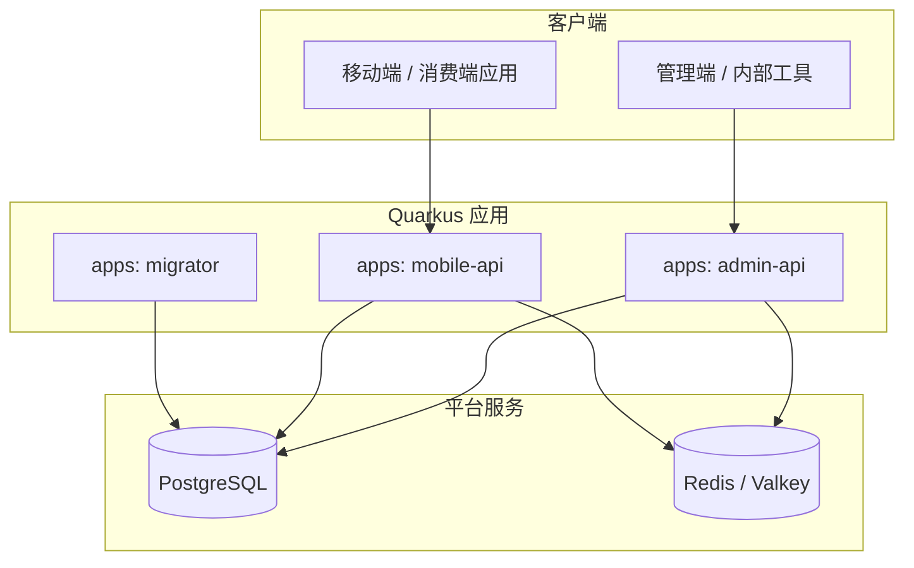
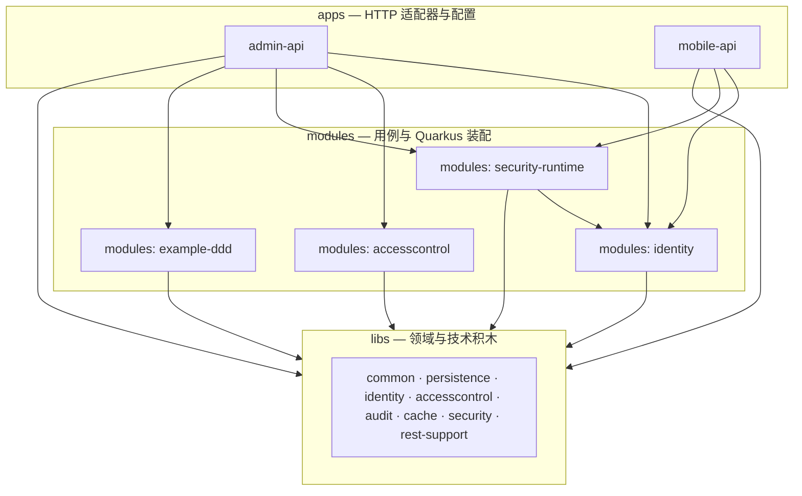
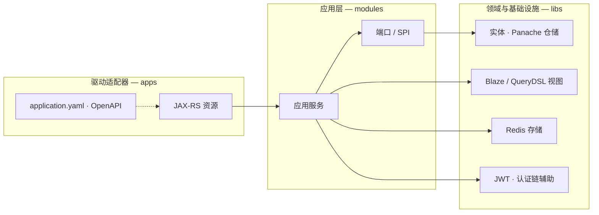
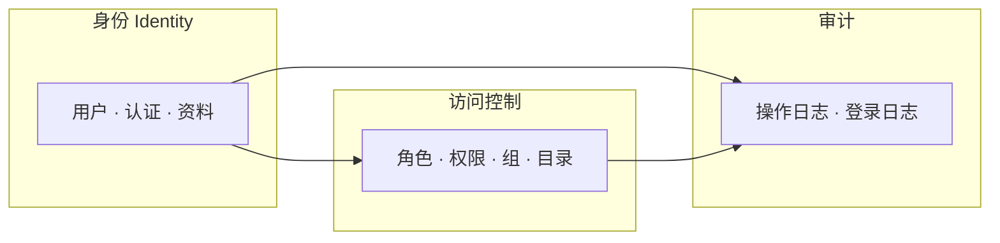
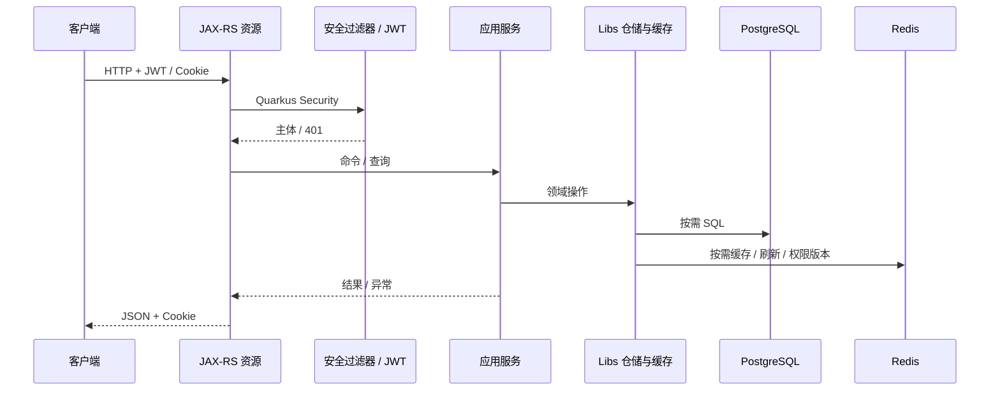

# 项目设计、DDD 分层与技术选型

[English](PROJECT_DESIGN.md)

本文说明**为何**采用当前仓库结构、如何对应 **DDD 风格分层**、这样做的**收益**、**后续演进**时的便利，以及**技术选型细节**（版本与 `gradle/libs.versions.toml` 对齐）。

目录与 Gradle 工程名另见 [ARCHITECTURE_DDD.zh-CN.md](ARCHITECTURE_DDD.zh-CN.md)。

---

## 1. 设计目标

模板面向需要以下能力的 **JVM 后端基础**：

- **RBAC**，权限快照适合缓存
- **JWT** 访问令牌与 **刷新令牌** 流程
- **多个可部署进程**共享同一套领域能力（如管理端与 C 端），避免核心逻辑复制粘贴
- **边界清晰**，避免所有功能堆进单一「大应用包」
- **工程化**：格式化、静态分析、覆盖率、依赖漏洞扫描

布局**不是**教科书式的处处六边形，而是 **务实的 DDD 切分**：共享模型与技术积木放在 **`libs`**，用例与编排放在 **`modules`**，HTTP 与进程配置放在 **`apps`**。

---

## 2. 总体结构（三层 Gradle 工程）

| 层次 | Gradle 工程 | 职责 |
|------|-------------|------|
| **共享内核与技术积木** | `libs:*` | 实体、Panache 仓储、Redis 存储、安全原语、共享 JAX-RS 辅助。可被多个 module/app 复用。 |
| **应用 / 限界上下文** | `modules:*` | 应用服务、端口（接口）、在需要时对接 Quarkus 的 CDI 适配器。按上下文分目录（`identity`、`accesscontrol`、`security-runtime`、`example-ddd`）。 |
| **驱动适配器与部署单元** | `apps:*` | JAX-RS 资源、OpenAPI、`application.yaml`，以及** classpath 上挂哪些模块**。同一套领域，不同**部署形态**与 **API 面**（`admin-api` vs `mobile-api`）。 |

**依赖方向（约定）：** `apps` → `modules` → `libs`。`modules` 之间避免深层互相依赖，仅在明确需要时连接（例如 `security-runtime` 基于 `modules:identity`），以便在 Gradle 里看见**编译期边界**。

### 2.1 架构图（Mermaid）

#### 系统上下文：进程与基础设施

客户端访问 **admin-api** 或 **mobile-api**；**migrator** 对 PostgreSQL 执行 Flyway。两个 API 使用 PostgreSQL 与 Redis/Valkey：持久化、令牌、权限快照，以及可选的重放 nonce。

#### 编译期分层：`apps` → `modules` → `libs`

Gradle 决定「谁能看见谁」。**mobile-api** 刻意不依赖 **accesscontrol** 与 **example-ddd**，避免 C 端接口误用管理端 CRUD 或示例领域代码。

*（**apps:migrator** 是独立的 Flyway/JDBC 进程；见上一张系统上下文图。）*

#### 单个 API 进程内的 DDD 对应关系

HTTP 在 **apps**；编排在 **modules**；实体、仓储、Redis 辅助、安全原语主要在 **libs**。**rest-support** 为声明依赖的应用提供统一的 JAX-RS 横切行为。

#### 限界上下文（RBAC 核心）

身份（用户、登录、资料）与访问控制（角色、权限、组）协作；审计记录操作与登录流水。

#### 概念上的认证请求链路

---

## 3. DDD 风格分层（如何对应）

经典 DDD 有**领域、应用、基础设施、接口**四层，本仓库对应如下：

- **领域模型（实体、值对象、不变式）**  
  主要在 **`libs`** 的上下文库中（`libs:identity`、`libs:accesscontrol`、`libs:audit` 等）。持久化注解与 Panache 基类贴近模型是务实选择（贫血/充血由你演进；关键是**业务词汇**与 HTTP 解耦）。

- **应用层（用例、编排、端口）**  
  在 **`modules:*`**（如 `modules:identity` 管登录/资料，`modules:accesscontrol` 管用户/角色/权限）。协调实体、仓储、缓存与安全，**不依赖**具体 URL。

- **基础设施（DB、Redis、JWT、过滤器）**  
  一部分在 **`libs`**（缓存实现、Blaze/QueryDSL 查询辅助），一部分在 **`modules:security-runtime`**（Quarkus 装配：认证管线、签发 JWT、权限增强、重放过滤）。

- **驱动适配器（REST）**  
  在 **`apps/*`**，薄资源层做 HTTP ↔ 应用服务/DTO。**libs:rest-support** 统一异常映射与 Cookie 工具。

**RBAC 模板中的限界上下文：**

| 上下文 | 主要 libs | module |
|--------|-----------|--------|
| 身份与认证编排 | `libs:identity`、`libs:security`、`libs:cache` 等 | `modules:identity` |
| RBAC 管理 | `libs:accesscontrol`、`libs:identity` 等 | `modules:accesscontrol` |
| 横切安全运行时 | 组合各 libs | `modules:security-runtime` |
| 审计 | `libs:audit` | 由 identity/accesscontrol 流程写入 |
| 示例业务切片 | 模块内实体/适配器风格同 persistence | `modules:example-ddd` |

`modules:example-ddd` 可作为**新增上下文**的参照：端口在 module、Panache（或其它）适配器同处，REST 仅在被依赖的 app 中暴露。目录上 **`application.port.in`** 为入站端口（驱动适配器只依赖接口），**`application.port.driven`** 为被驱动侧端口（由 `infrastructure` 实现；不用 `out` 以免与 `.gitignore` 的 `out` 冲突）。

---

## 4. 收益

1. **职责清晰**：RBAC、身份、示例电商分属不同 Gradle 工程，评审与上手可按**上下文名**定位，而非单包扫全库。  
2. **依赖可控**：Gradle 约束调用关系；例如 `mobile-api` 不引入 `modules:accesscontrol`，C 端不会误连管理端 CRUD。  
3. **可测性**：`modules` 内应用服务可用端口 mock，无需起 HTTP；集成测试可按 app/module 边界组织。  
4. **运维灵活**：管理端与 C 端可**独立扩缩、配置、发布**，仍共享 JWT、Redis、DB 约定；异常与刷新 Cookie 集中在 **rest-support**。  
5. **减少重复**：权限目录缓存、令牌存储、异常映射各实现一次，多 app **组合**复用。

---

## 5. 演进路径（后续哪里更省事）

| 方向 | 结构带来的便利 |
|------|----------------|
| **新限界上下文** | 新增 `libs:your-context`（模型+持久化）与 `modules:your-context`（用例+适配器）；可仅从 `admin-api` 依赖。 |
| **新 API 进程** | 新建 `apps:your-api`，独立 `application.yaml`、`app.identity.*`，按需最小依赖 `modules`/`libs`。 |
| **替换或拆分基础设施** | `modules` 的端口 + `libs` 接口便于换 Redis 用法、加事件总线、抽读模型，而不必先重写 REST。 |
| **更严格的六边形** | 可把 Panache 实体渐进挪到 module 内「基础设施」包，领域接口留在上层——Gradle 分层已预留空间。 |
| **共享契约** | 每 app 一份 OpenAPI；对内 DTO 与资源同包；需要时可抽 `libs:api-contract`。 |

---

## 6. 技术选型（细节）

版本以 **`gradle/libs.versions.toml`** 为准，升级时改 catalog。

### 6.1 平台与语言

| 选型 | 版本 / 说明 |
|------|-------------|
| **JDK** | **25**（Gradle 工具链；部分代码使用灵活构造器体等语言特性） |
| **Quarkus** | **3.32.4**（BOM） |
| **构建** | Gradle + **typesafe project accessors**（`projects.libs.*`、`projects.modules.*`） |

### 6.2 HTTP 与 API

| 选型 | 说明 |
|------|------|
| **Jakarta REST**（`quarkus-rest`、`quarkus-rest-jackson`） | 服务端 REST，JSON 经 Jackson |
| **SmallRye OpenAPI** | `/q/openapi`，开发态 Swagger UI |
| **Hibernate Validator** | 资源与服务上的 Bean Validation |

### 6.3 数据访问与表结构

| 选型 | 版本 / 说明 |
|------|-------------|
| **PostgreSQL** | `quarkus-jdbc-postgresql`，Agroal 连接池 |
| **Hibernate ORM + Panache** | `libs` 中 Active Record / Repository 风格 |
| **Schema** | 应用侧常用 **`validate`**；**Flyway** 在 `apps:migrator` |
| **Blaze-Persistence** | **1.6.18** + Quarkus 集成；Entity View 用于查询/投影 |
| **QueryDSL** | **7.1**（Jakarta APT）；与 Blaze 在 persistence 中集成 |
| **Snowflake ID** | `io.github.daiyuang:hibernate-snowflake-id:0.0.1`（使用处） |
| **物理命名** | 如 `CamelCaseToUnderscoresNamingStrategy` |

### 6.4 安全与身份

| 选型 | 说明 |
|------|------|
| **Quarkus Security** | 与 HTTP 权限集成 |
| **SmallRye JWT** | 校验/签发；RSA 由 `generateRsaKeys` 任务生成 |
| **Elytron common** | 安全工具类 |
| **自定义 Provider 链** | 配置用户 + DB 登录编排在 `libs:security` / `modules:security-runtime` |
| **密码哈希** | BCrypt（见 `application.yaml` 中配置用户） |
| **WildFly Elytron SASL Digest** | **2.8.3.Final**（digest 相关流程） |

### 6.5 缓存与 Redis

| 选型 | 说明 |
|------|------|
| **Quarkus Redis client** | 刷新令牌、权限版本、登录次数、权限目录、重放 nonce |
| **Caffeine** | 本地缓存（配置处） |
| **重放防护** | 可选 `@ReplayProtected`；时间戳 + nonce，Redis（`app.replay.*`） |

### 6.6 可观测性与运维

| 选型 | 说明 |
|------|------|
| **SmallRye Health** | 管理端口下存活/就绪 |
| **Micrometer + Prometheus** | `/q` 管理路径下指标 |
| **OpenTelemetry** | OTLP 导出（可配；`%dev` 常关） |
| **JSON 日志** | 示例配置为 ECS 风格控制台 JSON |
| **容器镜像** | `quarkus-container-image-docker` 构建元数据 |

### 6.7 代码质量

| 选型 | 说明 |
|------|------|
| **Checkstyle** | **10.18.2** |
| **SpotBugs** | **6.4.8** |
| **Spotless** | **8.4.0** |
| **OWASP Dependency-Check** | **12.2.0** |
| **JaCoCo** | 测试覆盖率 |
| **javac** | 根工程 **`JavaCompile`** 开启 **`-Xlint:deprecation`** |

### 6.8 其它依赖

| 库 | 版本 / 说明 |
|----|-------------|
| **Lombok** | Remal 插件 **3.1.6**（使用处） |
| **MapStruct** | **1.6.3** |
| **Record builder** | **52**（注解处理器） |
| **JetBrains annotations** | **26.1.0** |
| **Guava** | **33.5.0-jre** |
| **Jandex** | **2.3.0**（库 jar 的 CDI 索引） |

### 6.9 测试

| 选型 | 说明 |
|------|------|
| **JUnit 5 + Mockito** | Quarkus 测试扩展 |
| **REST Assured** | HTTP 契约/集成 |
| **Testcontainers** | **1.21.4**（PostgreSQL、JDBC） |

---

## 7. API 契约测试

身份相关接口的稳定 JSON 由 REST Assured 测试守护：

- **Admin：** `apps/admin-api/.../contract/AdminIdentityRestJsonContractTest.java`
- **Mobile：** `apps/mobile-api/.../contract/MobileIdentityRestJsonContractTest.java`

断言覆盖 `Result` 信封字段及令牌/资料 JSON 属性名；若失败，通常表示前端契约被破坏，应改客户端或做 API 版本化。

---

## 8. 相关文档

| 主题 | 文档 |
|------|------|
| Mobile 依赖白名单 | [MOBILE_API.zh-CN.md](MOBILE_API.zh-CN.md) |
| 目录树与包结构 | [ARCHITECTURE_DDD.zh-CN.md](ARCHITECTURE_DDD.zh-CN.md) |
| 权限校验与快照 | [AUTHORIZATION_FLOW.zh-CN.md](AUTHORIZATION_FLOW.zh-CN.md) |
| 生产加固清单 | [PRODUCTION_READINESS_CHECKLIST.zh-CN.md](PRODUCTION_READINESS_CHECKLIST.zh-CN.md) |
| 故障排查 | [TROUBLESHOOTING.zh-CN.md](TROUBLESHOOTING.zh-CN.md) |
