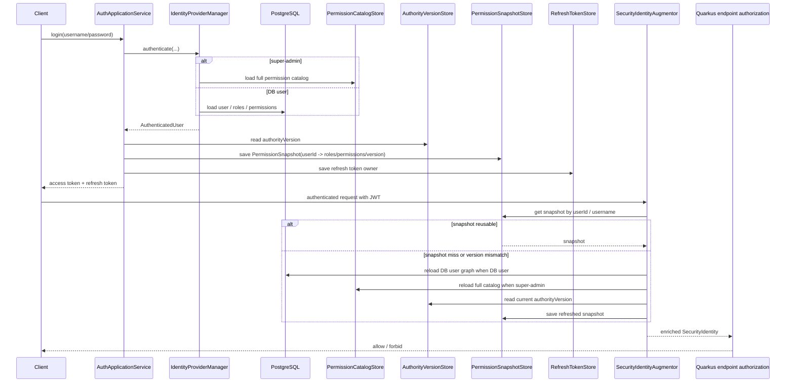

# Security Runtime Design

[中文](SECURITY_RUNTIME.zh-CN.md)

This document describes the security chain as it exists in the repository today.

## 1. Authentication and authorization chain

```mermaid
flowchart TD
  client[Client]
  authResource[AuthResource / MobileAuthResource]
  authApp[AuthApplicationService]
  idManager[IdentityProviderManager]
  superAdmin[SuperAdminAuthenticationProvider]
  dbUser[DbUserAuthenticationProvider]
  refreshProvider[AdminRefreshTokenAuthenticationProvider]
  tokenIssuer[AdminTokenIssuerPort / JwtAdminTokenIssuer]
  lifecycle[AdminAuthenticationLifecycle]
  jwt[JwtTokenService]
  refreshStore[(RefreshTokenStore / Redis)]
  snapshotStore[(PermissionSnapshotStore / Redis)]
  authorityVersion[(AuthorityVersionStore / Redis)]
  jwtReq[Quarkus JWT / SecurityIdentity]
  augmentor[AdminPermissionSecurityIdentityAugmentor]
  snapshotLoader[AdminPermissionSnapshotLoader]
  endpointAuthz[@PermissionsAllowed / @PermissionChecker]
  postgres[(PostgreSQL)]
  catalog[(PermissionCatalogStore / Redis)]

  client --> authResource
  authResource --> authApp
  authApp --> idManager
  idManager --> superAdmin
  idManager --> dbUser
  idManager --> refreshProvider

  superAdmin --> catalog
  dbUser --> postgres
  refreshProvider --> refreshStore
  refreshProvider --> postgres
  refreshProvider --> snapshotStore

  authApp --> lifecycle
  authApp --> tokenIssuer
  tokenIssuer --> jwt
  tokenIssuer --> refreshStore
  lifecycle --> snapshotStore
  lifecycle --> authorityVersion

  client --> jwtReq
  jwtReq --> augmentor
  augmentor --> snapshotStore
  augmentor --> snapshotLoader
  snapshotLoader --> postgres
  snapshotLoader --> catalog
  snapshotLoader --> authorityVersion
  augmentor --> endpointAuthz
```

### Current semantics

- Quarkus `IdentityProviderManager` fans into three authentication branches:
  - `super-admin`
  - database user
  - refresh token
- `mobile-api` no longer configures a `super-admin`, so that branch normally abstains there
- `super-admin` permissions come from the full runtime permission catalog, not from a hand-maintained list
- JWT primarily transports identity; effective request-time permissions come from the refreshed snapshot pipeline
- `authorityVersion` is a version hint, not a frozen permission list inside the access token; when it no longer matches, the next request reloads the snapshot
- role / permission / permission-group changes therefore take effect on the **same access token** on the next request
- disabling a user clears permission snapshots and refresh tokens; old access tokens are then rejected as stale identities and old refresh tokens can no longer refresh
- password changes revoke refresh tokens but do not proactively revoke already-issued access tokens; those remain usable until TTL expiry

## 2. Storage-layer data flow



### Data boundaries

- PostgreSQL is the source of truth for DB users, roles, permissions, and permission groups
- Redis/Valkey stores:
  - authority version
  - refresh token ownership
  - permission snapshots
  - permission catalog cache
- access control mutations bump the authority version so later requests invalidate and rebuild snapshots

## 3. Current token semantics

- **Permission expansion / revocation**
  - the same existing `accessToken` is re-evaluated against current RBAC state on the next request
  - newly granted permissions can immediately allow more endpoints, and revoked permissions can immediately produce `403`
- **Disabled user**
  - old `accessToken` requests return `401`
  - old `refreshToken` requests return `401` / `A0231`
- **Password change**
  - old `refreshToken` is revoked immediately
  - old password can no longer log in
  - new password can log in
  - already-issued `accessToken` is not force-revoked and remains valid until expiry

## 4. Differences from the old design notes

- `config users` were collapsed into a single `super-admin`
- `mobile-api` no longer exposes a configured `super-admin` backdoor
- the runtime chain is now described as `DB / super-admin / refresh token`, not `DB / config`
- `app.identity.*` keeps only `db-user-type` as configuration; `SUPER_ADMIN` is a fixed constant
- mobile docs no longer describe `mobile-member` / `mobile-merchant` as built-in config accounts

## 5. Related documents

- [AUTHORIZATION_FLOW.md](AUTHORIZATION_FLOW.md)
- [MOBILE_API.md](MOBILE_API.md)
- [INTEGRATION_TESTING.md](INTEGRATION_TESTING.md)
