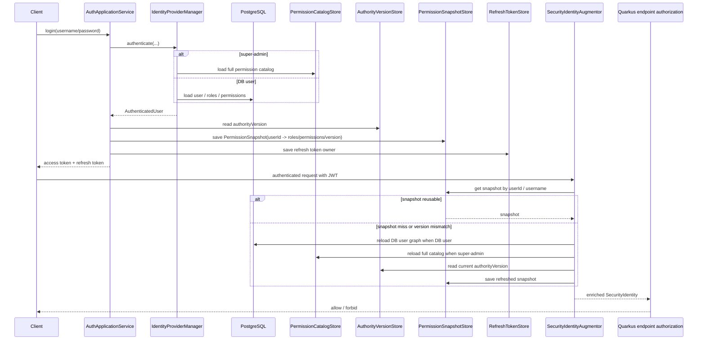

# Security 运行时设计

[English](SECURITY_RUNTIME.md)

本文档只描述当前仓库里已经落地的 security 主链，不讲泛化理论。

## 1. 认证与授权主链

```mermaid
flowchart TD
  client[客户端]
  authResource[AuthResource / MobileAuthResource]
  authApp[AuthApplicationService]
  idManager[IdentityProviderManager]
  superAdmin[SuperAdminAuthenticationProvider]
  dbUser[DbUserAuthenticationProvider]
  refreshProvider[AdminRefreshTokenAuthenticationProvider]
  tokenIssuer[AdminTokenIssuerPort / JwtAdminTokenIssuer]
  lifecycle[AdminAuthenticationLifecycle]
  jwt[JwtTokenService]
  refreshStore[(RefreshTokenStore / Redis)]
  snapshotStore[(PermissionSnapshotStore / Redis)]
  authorityVersion[(AuthorityVersionStore / Redis)]
  jwtReq[Quarkus JWT / SecurityIdentity]
  augmentor[AdminPermissionSecurityIdentityAugmentor]
  snapshotLoader[AdminPermissionSnapshotLoader]
  endpointAuthz[@PermissionsAllowed / @PermissionChecker]
  postgres[(PostgreSQL)]
  catalog[(PermissionCatalogStore / Redis)]

  client --> authResource
  authResource --> authApp
  authApp --> idManager
  idManager --> superAdmin
  idManager --> dbUser
  idManager --> refreshProvider

  superAdmin --> catalog
  dbUser --> postgres
  refreshProvider --> refreshStore
  refreshProvider --> postgres
  refreshProvider --> snapshotStore

  authApp --> lifecycle
  authApp --> tokenIssuer
  tokenIssuer --> jwt
  tokenIssuer --> refreshStore
  lifecycle --> snapshotStore
  lifecycle --> authorityVersion

  client --> jwtReq
  jwtReq --> augmentor
  augmentor --> snapshotStore
  augmentor --> snapshotLoader
  snapshotLoader --> postgres
  snapshotLoader --> catalog
  snapshotLoader --> authorityVersion
  augmentor --> endpointAuthz
```

### 当前实现的关键点

- Quarkus `IdentityProviderManager` 当前分发到三类认证来源：
  - `super-admin`
  - DB 用户
  - refresh token
- `mobile-api` 不再配置 `super-admin`，因此它的 provider 链里这条分支通常会直接 `abstain`
- `super-admin` 权限不是手工配置列表，而是运行时读取权限目录全量代码
- JWT 主要承担身份传输；请求时最终权限以 Redis 快照 / DB 重新装载后的结果为准

## 2. 存储层数据流转



### 数据边界

- PostgreSQL 是 DB 用户、角色、权限、权限组的最终持久化来源
- Redis/Valkey 承担：
  - authority version
  - refresh token owner
  - permission snapshot
  - permission catalog cache
- access control 侧变更用户/角色/权限后会 bump authority version；后续请求会触发快照失效与重装载

## 3. 当前和旧文档不一致、已修正的点

- `config users` 已收敛成单个 `super-admin`
- `mobile-api` 不再配置 `super-admin` 后门账号
- security 主链不再描述成 “DB/config login”，而是 “DB/super-admin/refresh token”
- `app.identity.*` 现在只保留 `db-user-type` 作为可配置项；`SUPER_ADMIN` 是固定常量
- 文档里不再宣称移动端存在 `mobile-member` / `mobile-merchant` 这类配置账号

## 4. 相关文档

- [AUTHORIZATION_FLOW.zh-CN.md](AUTHORIZATION_FLOW.zh-CN.md)
- [MOBILE_API.zh-CN.md](MOBILE_API.zh-CN.md)
- [INTEGRATION_TESTING.zh-CN.md](INTEGRATION_TESTING.zh-CN.md)
